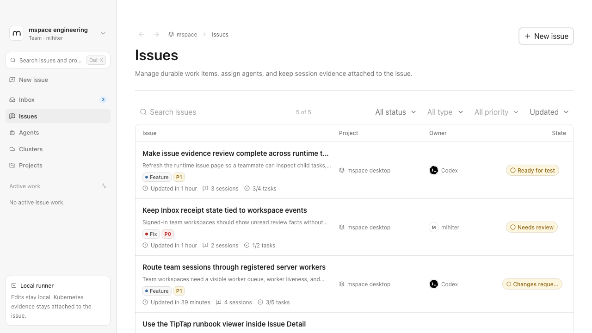
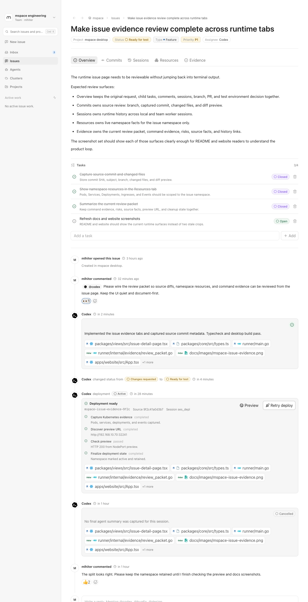
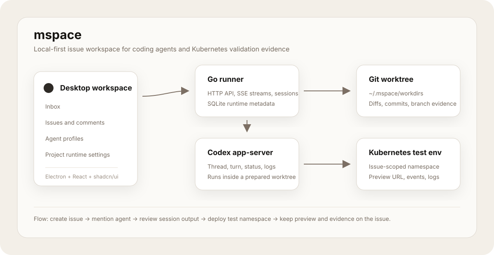

<!-- prettier-ignore -->
<div align="center">


# mspace

**A desktop workspace plus server control plane for coding agents, issue review, and Kubernetes validation evidence.**


[Overview](#overview) - [Screenshots](#screenshots) - [Website](#website) - [Features](#features) - [Architecture](#architecture) - [Quick Start](#quick-start) - [Verification](#verification) - [Docs](#docs)

</div>

## Overview

mspace is a review Inbox and Issue workspace for software teams that want coding agents to work in real repositories and validate changes in namespace-scoped Kubernetes test environments.

The interaction model is closer to a shared engineering document than a terminal transcript: each issue keeps the problem statement, child tasks, comments, agent sessions, source branch state, runtime logs, deployment evidence, preview URL, and cleanup decision in one place.

> [!NOTE]
> mspace is a runnable local desktop MVP with a server-owned control plane. Local username/password auth works in restricted or offline environments, and GitHub OAuth remains an optional external identity provider. Team/shared deployments store product data, runtime task state, test environment records, cluster configs, agent profiles, PR handoffs, worker logs, and results in server Postgres; packaged personal desktop mode runs the same control plane on a local server-owned SQLite store. Runtime workers claim tasks from the server queue and prepare their own repo cache/workdir.

## Screenshots

The README intentionally shows only a representative pair. Current and task-specific captures live in `docs/images/`; article embeds should use uploaded cloud image URLs instead of local repository paths.





## Website

Public site: [mspace-website-blue.vercel.app](https://mspace-website-blue.vercel.app)

The website is a Vite/React/Tailwind brand surface in `apps/website`. It is intentionally bolder than the desktop product shell, but it stays anchored to the product story: issue workspace, Codex-backed sessions, source diffs, Kubernetes namespace previews, review evidence, and cleanup decisions. It also exposes a static `Changelog` navigation view backed by `apps/website/src/changelog.ts`.

```bash
pnpm dev:website
pnpm build:website
pnpm preview:website
```

Production deployment uses the root `vercel.json`:

- install: `pnpm install --frozen-lockfile`
- build: `pnpm --filter @mspace/website build`
- output: `apps/website/dist`

## Features

- Electron desktop app with Inbox, Issues, Tests, Agents, Environments, Projects, Workspace Settings, Issue Detail, and Session Detail screens.
- Go server control plane with local password auth, optional GitHub OAuth, explicit auth identity provider/login, mspace session tokens, personal/team workspaces, workspace membership, one-time team join links with safe signed-out previews, Inbox receipts, projects, runbooks, test cases, test case suggestions, test plans, test runs, issues, comments, reactions, labels, runtime worker registration, agent profiles, environments, Kubernetes cluster compatibility records, test environments, PR handoffs, runtime tasks, worker logs, and runtime results.
- Runtime worker daemon in `worker/` that registers with `msw_...`, heartbeats, claims matching server tasks, prepares its own repo cache/workdir, runs `codex app-server --listen stdio://`, streams logs, captures source metadata, and reports task results.
- Codex execution belongs to runtime workers. The server image does not install Codex or mount Codex credentials.
- Workspace Settings for team access, worker host installation, worker liveness, issue-linked runtime tasks, task events, task logs, and workspace automation.
- Notion-like paper workspace UI built with React 19, Tailwind CSS 4, Radix UI, lucide-react, Material Icon Theme file icons, and shadcn/ui source components in `@mspace/ui`.
- Bilingual desktop UI support for English and Simplified Chinese through `@mspace/i18n`.
- Document-style issue creation and comments with TipTap Markdown editing, inline child issues from checklist rows, image rendering for stable attachment URLs, and lightweight comment reactions.
- Agent mentions from issue comments, with server-side session records, runtime task queueing, profile instructions, trigger-comment tracking, worker logs, status updates, and issue timeline updates.
- Per-session worker-managed git worktrees, changed file lists, diff previews, commits, and comparison against the project default branch.
- Project-level Tests workspace with Cases, Case suggestions, Plans, and Runs tabs, dedicated detail pages, modal create/import flows, Markdown/text/CSV/Excel `.xlsx` import, readiness scoring, case-detail run history, field-level case revision summaries, and human review before Codex suggestions update canonical cases.
- Issue-backed test run workflow where selected ready cases or formal plans create issue-linked run items, workers execute through the existing agent-session path, `test-result.json` is reconciled into run state, supported screenshot evidence is persisted as server-owned artifacts, and a human accepts or blocks the run result.
- Reusable environments for Kubernetes clusters and virtual machines. Kubernetes environments can be imported from kubeconfig files with read-only reachability checks, image registry prefix, preview routing defaults, and optional Kubernetes context; virtual machine environments store SSH target metadata and credential references.
- Manual issue test deployment that queues an agent turn to create the namespace, build and push images, deploy resources, expose a preview, and update the issue test environment record.
- Opt-in workspace automation that queues the same test deployment flow after a successful source session captures a commit, when the issue and runtime are ready.
- Issue Resources tab for the current test namespace, showing Pods, Services and NodePort mappings, Deployments, Ingresses, and recent Events without accepting cross-namespace input.
- Issue Evidence tab for the current review packet, with full-width pages for previous attempts and Kubernetes snapshot history.
- Issue-level branch / PR handoff records that keep one current PR with source branch, source commit, head commit, commit list, preview URL, evidence summary, local preflight errors, and refreshable PR state.
- Structured failure evidence for failed sessions, deploy reconciliation, preview checks, interruption, and cleanup failures.

> [!IMPORTANT]
> Generated scoped kubeconfigs, ServiceAccounts, server-owned GitHub App PR execution, and Kubernetes-hosted agent runtime are future work. The current MVP uses stored kubeconfig paths for test environments and fixed workers for execution.

## Architecture

mspace separates collaboration, execution, and validation:



| Layer | What it owns | Current implementation |
| --- | --- | --- |
| Control plane | Users, workspaces, product data, membership, local password credentials, GitHub identity, explicit auth identity display, mspace auth sessions, agents, environments, Kubernetes cluster compatibility records, test environments, PR handoffs, agent sessions, runtime task/log/result state, future GitHub App installations | Go server in `server/`, chi, Postgres for team/shared deployments, local SQLite for packaged personal desktop mode |
| Desktop workspace | Inbox, issues, comments, projects, agents, sessions, evidence review, language preference | Electron, React, TanStack Router, React Query, shared `@mspace/ui` and `@mspace/i18n` |
| Runtime worker | Personal or team-owned fixed machine, VM, DevBox, or Docker dev worker that claims server tasks | Go daemon in `worker/`, registered with `msw_...`, worker-managed repo cache and workdir |
| Agent runtime | One issue-bound turn in an isolated working directory | Worker-managed git workdir under the selected runtime mode |
| Environment / validation target | Reusable Kubernetes or virtual machine targets that decoupled workers can operate; current issue deploys build, deploy, inspect, preview, and cleanup Kubernetes issue test environments | Environment records in the server store; namespace-scoped Kubernetes workflow triggered from Issue Detail |

The desktop process uses `MSPACE_SERVER_URL` first, then a saved Team server URL, then starts the local bundled/dev server on `127.0.0.1:8787` when no configured server is active. Execution happens through registered workers, not through a desktop-owned local product store.

## Quick Start

### Requirements

- Node.js and pnpm.
- Go 1.24 or newer.
- Git on `PATH`.
- Codex CLI on `PATH` for real Codex worker sessions.
- `kubectl` only when running deployment or validation flows that inspect Kubernetes.
- PostgreSQL through `DATABASE_URL` for server/team deployments. Packaged personal desktop mode uses a local SQLite store by default.

### Run the desktop app

```bash
pnpm install
pnpm dev:desktop
```

Run the server separately only when debugging server behavior:

```bash
cp .env.example .env.local
# edit .env.local with DATABASE_URL only when testing Postgres; GitHub OAuth values are optional
pnpm run server
```

Personal desktop workspaces start a host-local Codex worker automatically before an agent mention is submitted. The desktop creates a short-lived `msw_...` credential, stores it in an Electron user-data token file, renews it before expiry, and revokes the previous credential after the worker has had time to pick up the replacement. Workspace Settings labels these desktop-managed credentials as automatic and keeps expired or replaced credentials in audit history so renewals do not look like duplicate manual tokens.

Team workspaces normally connect external worker runtime hosts from Workspace Settings with a one-time install command. Run that command on the server, VM, DevBox, or other Docker-capable host that should claim agent tasks; the worker registers itself and appears online after its first heartbeat. Customer Helm installs can also enable `bootstrap.teamWorkspace.enabled=true` to create an admin-owned default team workspace and register the chart-managed fixed worker during server startup. The raw `msw_...` token flow is still available through the API for development and recovery, but it is not the product setup path.

Manual worker debugging:

```bash
export MSPACE_RUNTIME_TOKEN="msw_..."
pnpm worker
```

For Docker-backed worker testing:

```bash
scripts/run-server-worker-dev.sh
scripts/run-server-worker-codex-dev.sh
```

For customer Kubernetes deployment, use the Helm chart and runbook under `deploy/helm/mspace` and `docs/kubernetes-deployment.md`. The fixed-worker path expects the operator to create the worker Codex home Secret first, using a worker-scoped `auth.json` plus the repository-owned `deploy/codex/worker-config.toml` or an untracked private-provider variant.

Build a macOS desktop package for internal dogfood:

```bash
pnpm dist:desktop:mac
```

The packaged desktop app includes bundled `mspace-server` and `mspace-worker` binaries. When no remote server is configured, it starts the server in personal mode with a local SQLite store under the app user-data directory; the personal worker is kept alive against the selected personal workspace before Codex-backed agent turns, and its bootstrap credential is renewed in the background.

### First workflow

1. Sign in with a local account, or use GitHub OAuth when it is configured, then select the personal or team workspace. For team access from an invitation, open the join link; the desktop switches to the invited team server, shows a safe preview, lets you sign in or create an account if needed, accepts the invitation, and opens the invited workspace.
2. Create an issue in the Issues tab with a document-style note.
3. Attach or create a project before agent execution, PR handoff, project runbook access, Tests, or test environments. Personal workspaces can use a local folder or GitHub URL; team workspaces require a GitHub URL so connected workers can clone the repository.
4. In Tests, import or create project cases. Markdown/text imports use one non-empty line per case; CSV and `.xlsx` workbooks use the same column contract: `title`, `type`, `area`, `priority`, `preconditions`, `steps`, `expected_result`, `environment_requirements`, and `tags`. Valid case types are `functional`, `ui`, `api`, and `deployment`.
5. Create/import an Environment. Import kubeconfigs for Kubernetes test environments, or add a virtual machine target for SSH-oriented deployment testing.
6. For personal desktop workspaces, let mspace start the local worker when you mention an agent. For team workspaces, connect a worker runtime host from Workspace Settings and run the generated install command on that host. Self-registered users stay in personal workspaces until a team owner/admin invites them; only server admins can create team workspaces.
7. Mention an enabled agent profile, such as `@codex`, in an issue comment, or start a test run from selected ready cases or a formal test plan.
8. Review session status, logs, branch state, and diffs from Issue Detail or Session Detail.
9. Use Commits for source review and PR handoff.
10. Trigger a manual test deployment from Issue Detail when ready, or enable workspace auto-deploy to queue it after successful source sessions.
11. Use Resources and Evidence to inspect namespace state, preview status, command evidence, failures, and cleanup decisions.

## Configuration

Desktop team server selection:

- Personal desktop mode uses the local bundled server by default, so most local users do not need to configure a server URL.
- The default local personal sign-in starts in account-creation mode and hides GitHub sign-in, even if the local dev server has OAuth variables configured.
- The sign-in screen keeps remote control-plane setup behind a collapsed Team server entry for deployed customer or team environments. Explicit team server launches start in login mode.
- Saved server URLs are stored in the Electron user-data profile for this device and reused on the next launch.
- `MSPACE_SERVER_URL` still works as a launch-time override and takes precedence over the saved UI value. When it is set, the Team server entry opens in a locked state for that launch.
- Team invitation links carry the server context in `mspace://invite/<token>?server=<team-server-url>`. When a recipient opens the link, the desktop checks that server before previewing or accepting the invitation, so users do not have to paste a server URL or invitation code manually.
- GitHub sign-in appears only for an explicitly configured team server, either a saved Team server URL or `MSPACE_SERVER_URL`, when that server reports `capabilities.githubAuth: true` from `/health`. For local OAuth debugging against `127.0.0.1:8787`, launch with `MSPACE_SERVER_URL=http://127.0.0.1:8787 pnpm dev:desktop` so the desktop treats the server as configured instead of default local personal mode.

Runtime variables:

| Variable | Default | Purpose |
| --- | --- | --- |
| `MSPACE_SERVER_ADDR` | `127.0.0.1:8787` | Address used by the server control plane. |
| `MSPACE_SERVER_URL` | `http://127.0.0.1:8787` | Launch-time server control-plane override for desktop and renderer. Takes precedence over the saved Team server setting. |
| `MSPACE_SERVER_START_TIMEOUT_MS` | `30000` | Startup health-check timeout for the server when launched by Electron. |
| `MSPACE_STORE` | inferred | Server storage mode: `postgres` when `DATABASE_URL` is set, otherwise `sqlite` for local personal mode. |
| `MSPACE_SQLITE_PATH` | app/user config path | SQLite file path for local personal mode. |
| `MSPACE_DATA_DIR` | none | Optional directory used to derive the default SQLite path for the server. |
| `DATABASE_URL` | none | Postgres connection string for the server control plane. |
| `MSPACE_DEV_POSTGRES_CONTAINER` | `mspace-postgres-dev` | Local Codex dev helper container name for auto-started Docker Postgres. |
| `MSPACE_DEV_POSTGRES_VOLUME` | `mspace-postgres-data` | Durable named Docker volume for local control-plane Postgres data. |
| `MSPACE_DEV_POSTGRES_IMAGE` | `postgres:16` | Docker image used when the local Codex dev helper creates Postgres. |
| `MSPACE_GITHUB_CLIENT_ID` | none | Optional GitHub OAuth client ID used by the server. |
| `MSPACE_GITHUB_CLIENT_SECRET` | none | Optional GitHub OAuth client secret; belongs on the server only. |
| `MSPACE_GITHUB_REDIRECT_URI` | none | Optional GitHub OAuth callback URL for the server. |
| `MSPACE_SERVER_ADMIN_LOGINS` | none | Comma-separated local password logins or GitHub logins allowed to create team workspaces. |
| `MSPACE_BOOTSTRAP_ADMIN_LOGIN` | none | Optional local password login created on server startup and treated as a server admin. |
| `MSPACE_BOOTSTRAP_ADMIN_PASSWORD` | none | Required with `MSPACE_BOOTSTRAP_ADMIN_LOGIN`; the server does not reset an existing account password. |
| `MSPACE_BOOTSTRAP_ADMIN_NAME` | login | Optional display name for the bootstrap admin account. |
| `MSPACE_BOOTSTRAP_ADMIN_EMAIL` | none | Optional bootstrap identity email; not used for admin matching. |
| `MSPACE_BOOTSTRAP_TEAM_WORKSPACE_NAME` | none | Optional team workspace name to create during server startup for Helm fixed-worker installs. Requires `MSPACE_BOOTSTRAP_RUNTIME_TOKEN`. |
| `MSPACE_BOOTSTRAP_RUNTIME_TOKEN` | none | Optional pre-created `msw_...` token that the server registers against the bootstrap team workspace. Helm sets this from the release Secret when `bootstrap.teamWorkspace.enabled=true`. |
| `MSPACE_BOOTSTRAP_RUNTIME_TOKEN_NAME` | `Helm fixed worker` | Display name for the bootstrap runtime token metadata. |
| `MSPACE_BOOTSTRAP_RUNTIME_TOKEN_TTL_HOURS` | `2160` | Runtime token TTL in hours for the bootstrap fixed worker, capped at 90 days. |
| `MSPACE_RUNTIME_TOKEN` | none | `msw_...` runtime worker registration token used by `pnpm worker`. |
| `MSPACE_WORKER_NAME` | host-derived | Stable worker name shown in Workspace Settings. |
| `MSPACE_WORKER_MODE` | `team` | Runtime mode reported to the server by install commands and worker scripts; `team` or `personal`. |
| `MSPACE_WORKER_IMAGE` | `crpi-7jr40k6elhldekqp.cn-hangzhou.personal.cr.aliyuncs.com/mlhiter/mspace-worker-codex:dev` | Docker image used by generated self-host worker install commands. |
| `MSPACE_WORKER_CONTAINER` | `MSPACE_WORKER_NAME` | Docker container name used by generated self-host worker install commands. |
| `MSPACE_WORKER_CAPABILITIES` | worker-dependent | Worker capability JSON used by server-side task matching. The plain worker default is `{"protocolSmoke":true,"codex":false,"dryRun":true}`; generated self-host install commands default to Codex/Docker/Kubectl-capable JSON with `dryRun:false`. |
| `MSPACE_WORKER_LABELS` | worker-dependent | Worker placement/inventory labels. Generated self-host install commands default to `{"provider":"self-host","environment":"docker"}`. |
| `MSPACE_WORKER_VOLUME` | `mspace-worker-${MSPACE_WORKER_NAME}` in install commands | Docker volume mounted at `/var/lib/mspace-worker` for worker-managed repo caches, session worktrees, and artifacts. |
| `MSPACE_WORKER_WORK_ROOT` | `/var/lib/mspace-worker` in Docker | Runtime worker root for `repos/<cache-key>` and `workdirs/<project-id>/<session-id>`. |
| `MSPACE_WORKER_CODEX_HOME_SOURCE` | `${CODEX_HOME:-~/.codex}` | Source Codex home copied into the generated self-host worker Codex home before container startup. |
| `MSPACE_WORKER_CODEX_HOME_DIR` | `~/.mspace/codex-worker-home` | Host Codex home copy mounted by the Docker Codex dev worker. |
| `MSPACE_WORKER_CODEX_CLI_VERSION` | `0.130.0` | Codex CLI version installed by the Docker Codex dev worker image. |
| `MSPACE_AUTO_PERSONAL_WORKER` | enabled | Set to `0` to disable the desktop's automatic host-local personal worker. |

Local data paths:

| Path | Purpose |
| --- | --- |
| `<Electron userData>/mspace.db` | Packaged personal desktop SQLite store used by the bundled local server. |
| `<Electron userData>/worker/` | Host-local personal worker root for desktop-managed repo caches, workdirs, and artifacts. |
| `<Electron userData>/worker/tokens/<workspace-id>.token` | Short-lived personal worker credential file written by Electron and reread by the worker. |
| `~/.mspace/codex-worker-home` | Host-side Codex home copy for Docker Codex workers. |
| `/var/lib/mspace-worker/repos/<cache-key>` | Repository cache inside Docker-backed workers. |
| `/var/lib/mspace-worker/workdirs/<project-id>/<session-id>` | Per-session worker workdir inside Docker-backed workers. |
| `<worker-root>/workdirs/<project-id>/<session-id>/.mspace/session` | Session artifact directory. |
| `<artifact-dir>/test-environment.json` | Optional agent-written deployment result. |
| `<artifact-dir>/review-evidence.json` | Optional agent-written review snapshot. |
| `<artifact-dir>/test-case-proposals.json` | Optional Codex-written test case suggestion artifact reconciled into Case suggestions. |
| `<artifact-dir>/test-result.json` | Optional Codex-written test run artifact reconciled into run items and acceptance state. Supported screenshot evidence is transferred from the worker artifact directory, persisted as server-owned test artifacts, and shown from Case Detail / Run Detail. |
| `<artifact-dir>/branch-name.json` | Optional agent-written source branch proposal such as `{ "branch": "fix/pr-source-branch-selection" }`. |
| `<artifact-dir>/project-runbook.md` | Optional agent-written project runbook update. |

## Verification

```bash
pnpm typecheck
pnpm build:website
pnpm build:desktop
pnpm dist:desktop:mac
pnpm test:server
(cd packages/ui && pnpm dlx shadcn@latest info --json)
(cd worker && go test ./...)
(cd worker && go build ./...)
```

Health checks:

```bash
curl http://127.0.0.1:8787/health
```

> [!TIP]
> The shadcn/ui source files live under `packages/ui/src/components/ui`. If UI imports fail, check the root `components.json`, `packages/ui/components.json`, and the desktop Vite aliases for `@mspace/ui/components` and `@mspace/ui/lib`.

## Project Layout

```text
apps/desktop/        Electron desktop shell and renderer entrypoint
apps/website/        Public Vite/React brand site and changelog for the issue-to-evidence story
packages/core/       Shared API client and TypeScript types
packages/i18n/       Shared English and Simplified Chinese desktop localization
packages/ui/         Shared UI primitives and shadcn/ui source components
packages/views/      Product routes for Inbox, Issues, Tests, Agents, Projects, Sessions
server/              Go control plane for identity, workspaces, auth sessions, product state, runtime state
worker/              Go runtime worker for claiming and executing server tasks
docs/                Product, value thesis, architecture, IA, references, runbook, and images
```

## Docs

- [Product Brief](./docs/product.md)
- [Product Value Thesis](./docs/product-value.md)
- [Control Plane Direction](./docs/control-plane.md)
- [Architecture Notes](./docs/architecture.md)
- [API Integration Guide](./docs/integration-guide.md)
- [Kubernetes Deployment Runbook](./docs/kubernetes-deployment.md)
- [MVP Information Architecture](./docs/ia.md)
- [Runbook](./docs/runbook.md)
- [Test Module Plan](./docs/test-module-plan.md)
- [Reference Notes](./docs/references.md)
- [Design System](./DESIGN.md)
- [Website App Notes](./apps/website/README.md)
- [Roadmap](./ROADMAP.md)
