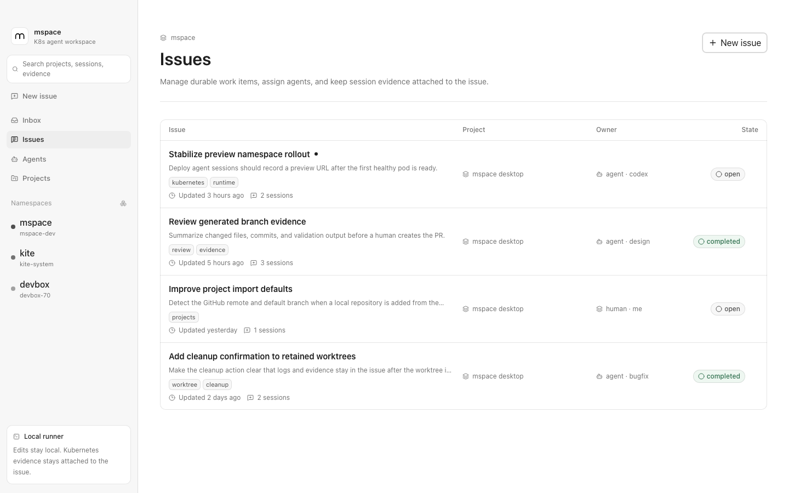
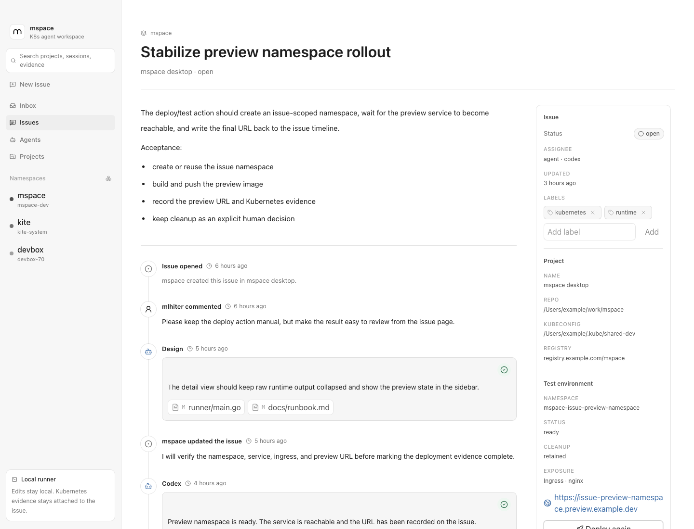

<!-- prettier-ignore -->
<div align="center">


# mspace

**A desktop workspace plus server control plane for coding agents, issue review, and Kubernetes validation evidence.**


[Overview](#overview) • [Screenshots](#screenshots) • [Website](#website) • [Features](#features) • [Architecture](#architecture) • [Quick Start](#quick-start) • [Verification](#verification) • [Docs](#docs)

</div>

## Overview

mspace is a review Inbox and Issue workspace for software teams that want coding agents to work in real repositories and validate changes in namespace-scoped Kubernetes test environments.

The interaction model is closer to a shared engineering document than a terminal transcript: each issue keeps the problem statement, inline child-issue tasks, comments, agent session, branch state, logs, deployment evidence, preview URL, and cleanup decision in one place.

> [!NOTE]
> mspace is currently a runnable local desktop MVP with a new server/control-plane skeleton. Agent execution is still local-first through Codex app-server, while the server is the target home for users, workspaces, membership, GitHub identity, auth sessions, and future GitHub App installation state.

## Screenshots





## Website

Public site: [mspace-website-blue.vercel.app](https://mspace-website-blue.vercel.app)

The website is a Vite/React/Tailwind brand surface in `apps/website`. It is intentionally bolder than the desktop product shell, but it should stay anchored to the same product story: issue workspace, local Codex sessions, source diffs, Kubernetes namespace previews, review evidence, and cleanup decisions. It also exposes a separate `Changelog` navigation view backed by `apps/website/src/changelog.ts`, so meaningful mspace tasks leave a public day-level progress log.

Local website commands:

```bash
pnpm dev:website
pnpm build:website
pnpm preview:website
```

Production deployment uses the root `vercel.json`:

- install: `pnpm install --frozen-lockfile`
- build: `pnpm --filter @mspace/website build`
- output: `apps/website/dist`

## Why mspace

- **Issues are the durable workspace.** Agent turns, child tasks, progress, blockers, session evidence, and review comments stay attached to the issue.
- **Local development stays fast.** Sessions run in prepared git worktrees under `~/.mspace/workdirs`.
- **Validation is real.** Test deployments use a saved cluster config and issue-scoped namespace to create Kubernetes preview environments.
- **Evidence is reviewable.** Code changes stay in Commits, while the Evidence tab shows compact command, test, build, deploy, namespace, preview, risk, and cleanup state without reconstructing context from a terminal.

## Features

- Electron desktop app with Inbox, Issues, Agents, Clusters, Projects, Issue Detail, and Session Detail screens.
- Go server control plane with GitHub OAuth entrypoints, state-bound desktop login polling, Postgres migrations, mspace session tokens, users, workspaces, workspace membership, and per-user issue-event Inbox receipts.
- GitHub-authenticated sidebar account/workspace state, plus local issue creator and comment actor display snapshots with human and Codex avatars.
- Notion-like paper workspace UI built with React 19, Tailwind CSS 4, Radix UI, lucide-react, Material Icon Theme file icons, and real shadcn/ui source components in `@mspace/ui`.
- Sidebar global search with a `Command+K` palette for jumping to issues and projects.
- Go local runner with HTTP APIs, SQLite storage, server-sent events, session logs, git-aware project import, and Codex app-server integration.
- Project import from a local folder or GitHub repository URL, including GitHub remote metadata detection when available.
- Managed agent profiles stored in SQLite, seeded with internal `@triage` plus user-facing `@codex`, `@bugfix`, and `@design`.
- Agent mentions from issue comments, with turn queueing, profile instructions, trigger-comment tracking, status updates, and issue timeline updates.
- Markdown-backed TipTap writing surfaces for issue creation and human issue comments, including checklist input that becomes child tasks plus image upload, paste, drop, thumbnail previews backed by stable attachment URLs, and lightweight comment reactions.
- Project runbooks stored by mspace with revision history, edited as Markdown from the Projects settings page, shown from the Issue Detail sidebar in a read-only TipTap modal, and learned from successful agent session artifacts.
- Per-session git worktrees, workspace inspection, changed file lists, diff previews, commits, and comparison against the project default branch.
- Type and priority labels, child issue task lists with create/toggle/delete controls, asynchronous type triage, server-backed unread Inbox updates with a sidebar badge, latest-comment editing before agent consumption, comment reactions, running-session stop controls, failed-session callouts, and manual worktree cleanup after completion or cancellation.
- Reusable cluster configs imported from kubeconfig files, with read-only reachability checks, image registry prefix, preview routing defaults, and optional Kubernetes context.
- Project default cluster selection.
- Manual issue test deployment that queues an agent turn to create the namespace, build and push images, deploy resources, expose a preview, reconcile Kubernetes evidence, and check preview status in the background.
- Issue Resources tab for the current test namespace, showing Pods, Services and NodePort mappings, Deployments, Ingresses, and recent Events without accepting cross-namespace input.
- Issue-level branch / PR handoff records that keep one current PR with source commit, head commit, commit list, preview URL, evidence summary, local preflight errors, and refreshable PR state.
- Workspace automation settings keep source commit capture always on and let users opt into automatic draft PR creation after captured source commits.
- Structured failure evidence for failed sessions, deploy reconciliation, preview checks, agent interruption, and cleanup failures, shown from Issue Detail Overview and Evidence so users can continue, retry deploy, stop, retain, or clean up instead of treating failure as terminal.

> [!IMPORTANT]
> Generated scoped kubeconfigs, ServiceAccounts, server-owned GitHub App automation, and Kubernetes-hosted agent runtime are future work. The MVP trusts the kubeconfig path configured on the selected cluster and uses the local `gh` identity for optional PR creation.

## Architecture

mspace separates collaboration, execution, and validation:


| Layer | What it owns | Current implementation |
| --- | --- | --- |
| Control plane | Users, workspaces, membership, GitHub identity, mspace auth sessions, future GitHub App installations | Go server in `server/`, chi, PostgreSQL through `pgx` |
| Desktop workspace | Inbox, issues, comments, projects, agents, sessions, evidence review | Electron, React, TanStack Router, React Query, shared `@mspace/ui` |
| Local runner | API, SQLite state, SSE streams, worktree preparation, Codex session lifecycle | Go, chi, SQLite, `codex app-server --listen stdio://` |
| Agent runtime | One issue-bound turn in an isolated working directory | Local git worktree under `~/.mspace/workdirs/<project-id>/<session-id>` |
| Validation target | Build, deploy, inspect, preview, and cleanup issue test environments | Namespace-scoped Kubernetes workflow triggered from Issue Detail |

The desktop process starts the Go runner automatically on `127.0.0.1:7788` and the server control plane on `127.0.0.1:8787`. Runner reuse requires a healthy `/health` response with the expected protocol capabilities, so stale local runners are replaced during desktop development.

## Quick Start

### Requirements

- Node.js and pnpm.
- Go 1.24 or newer.
- Git on `PATH`.
- Codex CLI on `PATH` for `codex app-server --listen stdio://`.
- `kubectl` only when running deployment or validation flows that inspect Kubernetes.

### Run the desktop app

```bash
pnpm install
pnpm dev:desktop
```

Run the runner separately when debugging API behavior:

```bash
pnpm runner
pnpm dev:desktop
```

The desktop app starts the local server control plane automatically. Run it separately only when debugging server behavior:

```bash
cp .env.example .env.local
# edit .env.local with your GitHub OAuth App values
pnpm run server
```

The server automatically loads `.env.local` from the project root. Keep `MSPACE_GITHUB_CLIENT_SECRET` in local env files or a deployment secret store, never in tracked docs or code.

### First workflow

1. Add a project from a local folder or GitHub repository URL.
2. Add a reusable test cluster in the Clusters tab, or use the first-run prompt to choose which discovered `~/.kube` kubeconfig files to import.
3. Select that cluster as the project default when needed.
4. Create an issue in the Issues tab with a document-style note; include the project or repository name when multiple projects exist.
5. Use checklist rows such as `- [ ] Add tests` when the issue needs child tasks, or paste/drop screenshots when the issue needs visual context.
6. Mention an enabled agent profile, such as `@codex`, in a rich issue comment.
7. Review session status, logs, branch state, and diffs from Issue Detail or Session Detail.
8. Open the Commits tab to review the issue-level PR card plus the captured commit list, then create or refresh the issue PR from the selected source branch when ready.
9. Optionally enable automatic draft PRs from Workspace Settings in the workspace menu if this workspace should refresh a draft PR after future source commits.
10. Trigger the manual test deployment action from Issue Detail and keep the preview URL and evidence on the issue.

## Configuration

Runtime variables:

| Variable | Default | Purpose |
| --- | --- | --- |
| `MSPACE_RUNNER_PORT` | `7788` | Port used when the desktop starts the local runner. |
| `MSPACE_RUNNER_URL` | `http://127.0.0.1:7788` | API base URL exposed to the renderer. |
| `MSPACE_RUNNER_START_TIMEOUT_MS` | `60000` | Startup health-check timeout for the runner. |
| `MSPACE_PORT` | `7788` | Port used by a standalone runner. |
| `MSPACE_SERVER_ADDR` | `127.0.0.1:8787` | Address used by the server control plane. |
| `MSPACE_SERVER_URL` | `http://127.0.0.1:8787` | Server control-plane URL exposed to the desktop renderer. |
| `MSPACE_SERVER_START_TIMEOUT_MS` | `30000` | Startup health-check timeout for the server when launched by Electron. |
| `DATABASE_URL` | none | Postgres connection string for the server control plane. |
| `MSPACE_GITHUB_CLIENT_ID` | none | GitHub OAuth client ID used by the server. |
| `MSPACE_GITHUB_CLIENT_SECRET` | none | GitHub OAuth client secret; belongs on the server only. |
| `MSPACE_GITHUB_REDIRECT_URI` | none | GitHub OAuth callback URL for the server. |

Local data paths:

| Path | Purpose |
| --- | --- |
| `~/.mspace/mspace.db` | SQLite database for issues, comments, reactions, sessions, evidence, failure records, handoffs, and local issue image attachment blobs. |
| `~/.mspace/repos/<owner>/<repo>` | Cached clone path for GitHub-imported projects. |
| `~/.mspace/workdirs/<project-id>/<session-id>` | Git worktree for one agent session. |
| `~/.mspace/workdirs/_contexts/<session-id>.md` | Session context markdown included in Codex prompts. |
| `~/.mspace/workdirs/<project-id>/<session-id>/.mspace/session` | Session artifact directory. |
| `~/.mspace/workdirs/<project-id>/<session-id>/.mspace/session/test-environment.json` | Optional agent-written deployment result; `previewUrl` is copied back to the issue test environment, including from continuation sessions that need to refresh the current preview. |
| `~/.mspace/workdirs/<project-id>/<session-id>/.mspace/session/review-evidence.json` | Optional agent-written review snapshot for commands, tests, build/deploy result, summary, risks, and follow-ups. |
| `~/.mspace/workdirs/<project-id>/<session-id>/.mspace/session/project-runbook.md` | Optional agent-written project runbook update imported after a successful session. |

## Verification

```bash
pnpm typecheck
pnpm build:website
pnpm build:desktop
pnpm test:server
(cd packages/ui && pnpm dlx shadcn@latest info --json)
(cd runner && go test ./...)
(cd runner && go build ./...)
```

Runner health check:

```bash
curl http://127.0.0.1:7788/health
```

> [!TIP]
> The shadcn/ui source files live under `packages/ui/src/components/ui`. If UI imports fail, check the root `components.json`, `packages/ui/components.json`, and the desktop Vite aliases for `@mspace/ui/components` and `@mspace/ui/lib`.

## Project Layout

```text
apps/desktop/        Electron desktop shell and renderer entrypoint
apps/website/        Public Vite/React brand site and changelog for the issue-to-evidence story
packages/core/       Shared API client and TypeScript types
packages/ui/         Shared UI primitives and shadcn/ui source components
packages/views/      Product routes for Inbox, Issues, Agents, Projects, Sessions
server/              Go control plane for identity, workspaces, auth sessions
runner/              Go local runner, SQLite migrations, Codex app-server bridge
docs/                Product, value thesis, architecture, IA, references, runbook, and images
```

## Docs

- [Product Brief](./docs/product.md)
- [Product Value Thesis](./docs/product-value.md)
- [Control Plane Direction](./docs/control-plane.md)
- [Architecture Notes](./docs/architecture.md)
- [Local API Integration Guide](./docs/integration-guide.md)
- [MVP Information Architecture](./docs/ia.md)
- [Local Runbook](./docs/runbook.md)
- [Reference Notes](./docs/references.md)
- [Design System](./DESIGN.md)
- [Website App Notes](./apps/website/README.md)
- [Roadmap](./ROADMAP.md)
